# texanshootR

<!-- badges: start -->
[](https://github.com/gcol33/texanshootR/actions/workflows/R-CMD-check.yaml)
[](https://lifecycle.r-lib.org/articles/stages.html#experimental)
[](https://opensource.org/licenses/MIT)
<!-- badges: end -->

<p align="center">
  
</p>

> **Mission.** To contribute to dubious research and questionable p-values.
>
> In this day and age where *publish or perish* reigns king, a [lone
> shooter](https://en.wikipedia.org/wiki/Texas_sharpshooter_fallacy) helps
> you out in your predicament.

The shooter starts composed. He fires at the side of a barn, then walks over
and paints the target around the densest cluster of bullet holes. By attempt
fifty he is uncertain. By two hundred he is worried. By the time the budget
is almost out he is desperate, and he has just enough breath left to escalate
to a derived metric. Either `p ≤ 0.05` lands somewhere on the wall or it does
not. There is a banner about it either way.

`texanshootR` is that loop; every `shoot()` call is one of his runs.

## Quick start

```r
library(texanshootR)

run <- shoot(mtcars)
print(run)
summary(run)
```

`shoot()` flails opportunistically (not systematically) across predictor
subsets, transformations, interactions, outlier exclusions, subgroup splits,
and (at higher career tiers) model families, biasing toward whatever is
*almost* significant and abandoning specs that go cold. The print method
leads with the shooter's face and the arc he followed
(`composed -> resolved`, `panicked -> resolved (last-minute)`,
`escalated to derived metrics`, etc.) before the formula and the p-value.

Every run is deterministic given a seed. The seed, R version, package
version, and a hash of the search trace are recorded on the returned
object so the full search can be replayed from any saved run.

Don't worry if your data is unpublishable — the shooter will change that.

## What's in the box

`texanshootR` is a state-of-the-art specification-search engine, generously
bundled with a career-progression system to recognise your dedication to the
craft. Progression is not decoration: your tier governs which model families
enter the search pool and which output generators you may deploy. Mastery,
after all, is earned.

### The search engine

* **Seven model families**, each with a native fitter (no soft dependencies on
  `mgcv`, `lme4`, or `lavaan` — the heavy ones are implemented in C++ via
  `Rcpp`, by hand, for your shooting needs):
  * `lm` — ordinary least squares via `.lm.fit()`
  * `cor` — bivariate Pearson / Spearman / Kendall
  * `glm` — Gaussian / binomial / Poisson / Gamma with link choices
  * `wls` — two-stage feasible weighted least squares
  * `gam` — penalised B-spline regression with GCV smoothing-parameter selection
  * `glmm` — Gaussian random-intercept LMM with profile-likelihood estimation
  * `sem` — single-mediator path model with Sobel test for the indirect effect
* **A family selector** that decides which fitter to attach to each spec based
  on career tier, escalation state, and outcome shape. At low tiers it sticks
  to `lm`. As tiers rise it leans on `glm`. Under desperation it occasionally
  forces a coercion (binomial on a continuous outcome, Poisson on a rounded
  one) — the shooter chasing the next-decimal p-value.
* **Search moves**: predictor-subset enumeration, transformation grids
  (`log`, `sqrt`, `^2`, centring), interaction screening, outlier-exclusion
  seeds, subgroup splits, and a derived-metrics escalation arc when the
  budget is running out.
* **Single result contract**: every fitter returns the same shape so the
  selector, the highlight chooser, and the run record never branch on family.

### The publication chain

A finished run is a `tx_run`. When `shoot()` lands a result that clears
`p <= 0.05`, it opens a *publication chain* — six ordered output stages,
each gated by its own wall-clock window:

```r
abstract(run)            # one-paragraph deadpan summary
manuscript(run)          # IMRaD draft; Methods match the *winning* spec
presentation(run)        # 8-slide deck; residual plot on slide 7
reviewer_response(run)   # opens "we thank the reviewer for their thoughtful comments"
graphical_abstract(run)  # the figure your PI will retweet
funding(run)             # the next grant, citing the just-shipped finding
```

The stages must be redeemed in that order. You have 30 seconds per stage
by default (`options(texanshootR.chain_window = N)` to change it). Land
every stage in your currently-unlocked prefix and the chain pays out a
length-bonus on top of the per-stage XP. Miss the window, call the wrong
stage, or fire a fresh `shoot()` before finishing — the chain breaks,
the bonus is forfeited, and the partial XP is what you keep.

Each generator writes to `tempdir()` by default and returns the file path
invisibly. Override with `output_dir =` or
`options(texanshootR.output_dir = ...)`.

### Career, achievements, cosmetics

Every redeemed stage awards XP. Cumulative XP grows the chain — same
thing as unlocking deeper stages of the publication lifecycle. Your
career tier is a label derived from your unlocked chain length, and it
governs which model families enter the search pool:

| Chain length | New stage              | XP needed | Career tier        | Families added       |
|--------------|------------------------|-----------|--------------------|----------------------|
| 1            | `abstract()`           | 0         | Junior Researcher  | `lm`                 |
| 2            | `manuscript()`         | 5         | Postdoc            | `cor`, `glm`         |
| 3            | `presentation()`       | 15        | Postdoc            | —                    |
| 4            | `reviewer_response()`  | 30        | Senior Scientist   | `wls`, `gam`         |
| 5            | `graphical_abstract()` | 55        | Senior Scientist   | —                    |
| 6            | `funding()`            | 90        | PI                 | `glmm`, `sem`        |

As pressure in the research career increases, so does the need for
`correlation = causation`...

Locked stages, expired windows, the wrong run, and out-of-order calls
all signal a structured `tx_chain_error` so your test suite can branch
on `reason`. Locked families simply never appear in the search trace.
Your earned chain length is permanent; you just can't shortcut into a
stage you haven't earned.

```r
career()        # tier, runs, favourite method, opaque scores
achievements()  # 20 unlockable badges; hidden ones show as ???
wardrobe()      # equipped cosmetic slots (hat, badge, cloak, poncho, lanyard)
progress()      # HUD: chain length, XP, next unlock, live chain window
run_log()       # tibble of every run on this profile
```

### Persistent state and saves

Your researcher profile persists under `tools::R_user_dir("texanshootR", "data")`
as flat YAML: human-readable, version-controllable, and yours to migrate
between institutions. The first interactive save prompts before writing
anything to disk. Opt out entirely with
`options(texanshootR.save_enabled = FALSE)` and the package becomes
pure-stateless: every call is independent, but progression remains inert at
Junior Researcher — and there is no path forward from there.

### The message pack

The TUI is driven by a YAML-backed message registry under `inst/messages/`
with **1,257 entries** across phases (`blip`, `loading`, `promotion`,
`reviewer`, `derived_escalation`, `state_transition`, `banner`,
`event`/`event_consequence`). Every message carries:

* a fallacy tag from `vocab_tags` (e.g. `p_hacking`, `harking`,
  `subgroup_fishing`, `causal_overreach`),
* a rarity weight,
* an optional `mascot_state_affinity` so the right line lands at the right
  emotional register,
* an optional `model_family_affinity` so the GAM-specific blip only fires
  when the run actually picked a GAM. Every family — `lm`, `cor`, `glm`,
  `wls`, `gam`, `glmm`, `sem` — has dedicated coverage.

You can audit the pack from R:

```r
validate_messages()    # schema + tag-vocabulary check
vocab_tags             # canonical fallacy + thematic tags
vocab_phases           # canonical trigger phases
vocab_mascot_states    # composed / uncertain / anxious / desperate / resolved
vocab_careers          # tier ladder
```

The schema lives at [`MESSAGE_SCHEMA.md`](MESSAGE_SCHEMA.md). Adding a new
message is a YAML edit and a re-run of `validate_messages()`.

## Reset

Should circumstances call for a fresh start — a new institution, a co-author
dispute, an opportune hard-drive failure, or because some of you just want
to see the world burn — your progression can be retired:

```r
reset_career(force = TRUE)
reset_achievements(force = TRUE)
reset_wardrobe(force = TRUE)
reset_all(force = TRUE)
```

## Installation

```r
# install.packages("pak")
pak::pak("gcol33/texanshootR")
```

The package compiles a small C++ backend (penalised least squares for `gam`,
profile-likelihood mixed model for `glmm`) on first install. No external
solver dependencies, no proprietary licences — onboarding is frictionless.

## Documentation

* [Getting Started](https://gillescolling.com/texanshootR/articles/getting-started.html)
* [Full Reference](https://gillescolling.com/texanshootR/reference/)
* [Message Pack Schema](MESSAGE_SCHEMA.md)
* [Contributing](CONTRIBUTING.md)

## Further reading

Brodeur, A., Cook, N. and Heyes, A. (2020).
*Methods Matter: P-Hacking and Publication Bias in Causal Analysis in
Economics.* **American Economic Review** 110(11): 3634–60.
<https://doi.org/10.1257/aer.20190687>

`texanshootR` is our humble contribution to a thriving field.

## Support

> "Where is the money, Lebowski?"
> &mdash; The Big Lebowski

I'm a PhD student who builds R packages in my free time, on the principle
that the tools of dubious research should be free and open. I started these
for my own questionable p-values, and figured the field deserved the same
head start.

If this package saved you some time (or pre-empted a fit of overfitting),
buying me a coffee is a nice way to say thanks.

[](https://buymeacoffee.com/gcol33)

## License

MIT &copy; Gilles Colling. See [LICENSE](LICENSE).

## Citation

```bibtex
@software{texanshootR,
  author = {Colling, Gilles},
  title  = {texanshootR: Reproducible Audit Trails for Indefensible Research},
  year   = {2026},
  url    = {https://github.com/gcol33/texanshootR}
}
```
