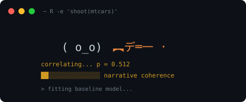

# texanshootR

> Small exact engines for scientific computing in R.

*running tests until one comes back significant*

<!-- badges: start -->
[](https://github.com/gcol33/texanshootR/actions/workflows/R-CMD-check.yaml)
[](https://lifecycle.r-lib.org/articles/stages.html#experimental)
[](https://opensource.org/licenses/MIT)
<!-- badges: end -->

<p align="center">
  
</p>

**A budgeted, seeded specification search that fires at the model space until `p <= 0.05` lands somewhere, then writes the paper.**

The [Texas sharpshooter](https://en.wikipedia.org/wiki/Texas_sharpshooter_fallacy)
fires at the side of a barn all night, walks over in the morning, and paints
a target around the densest cluster of holes. `texanshootR` is that loop, made
reproducible. Every `shoot()` call opens a wall-clock budget and flails across
predictor subsets, transformations, interactions, outlier exclusions, subgroup
splits, and — once the budget runs low — model families and derived metrics,
biasing toward whatever is *almost* significant and abandoning specs that go
cold. Either a hit lands on the wall or it does not. When one does, the package
writes the manuscript around it.

```r
library(texanshootR)

run <- shoot(mtcars)
print(run)      # the shooter's face, the emotional arc, then the formula and p-value
summary(run)    # counts per search axis
```

`shoot()` is deterministic given a seed. The seed, R version, package version,
and a hash of the full search trace are recorded on the returned `tx_run`, so
any saved run replays exactly. Unpublishable data is now the shooter's problem,
not yours.

## The search engine

Seven model families, each with a native fitter and no soft dependency on
`mgcv`, `lme4`, or `lavaan` — the heavy ones are written by hand in C++ via
`Rcpp`:

- `lm` — ordinary least squares via `.lm.fit()`
- `cor` — bivariate Pearson / Spearman / Kendall
- `glm` — Gaussian / binomial / Poisson / Gamma with link choices
- `wls` — two-stage feasible weighted least squares
- `gam` — penalised B-spline regression with GCV smoothing selection
- `glmm` — Gaussian random-intercept LMM by profile likelihood
- `sem` — single-mediator path model with a Sobel test for the indirect effect

A family selector attaches a fitter to each spec from the run's escalation
state and the outcome shape: `lm` early, `glm` under pressure, and the
occasional forced coercion (binomial on a continuous outcome, Poisson on a
rounded one) when the shooter is chasing the next decimal. Every fitter returns
the same result shape, so the selector, the highlight chooser, and the run
record never branch on family.

## The publication chain

A `tx_run` that clears `p <= 0.05` is shippable, and the first shippable run
opens a six-stage publication chain, redeemed in order:

```r
abstract(run)            # one-paragraph deadpan summary
manuscript(run)          # IMRaD draft; Methods match the winning spec
presentation(run)        # 8-slide deck; residual plot on slide 7
reviewer_response(run)   # opens "we thank the reviewer for their thoughtful comments"
graphical_abstract(run)  # the figure your PI will retweet
funding(run)             # the next grant, citing the just-shipped finding
```

Finishing the chain through your unlocked prefix collects a length-bonus on
top of the per-stage XP. Firing a fresh `shoot()` mid-chain forfeits the bonus
and keeps partial XP. Locked stages, expired windows, the wrong run, and
out-of-order calls all signal a structured `tx_chain_error` with a `reason`
field your tests can branch on. Each generator writes to `tempdir()` and
returns the file path invisibly; override with `output_dir =` or
`options(texanshootR.output_dir = ...)`.

## Career and unlocks

Redeemed stages award XP. Cumulative XP grows the chain prefix you can redeem,
and your career tier is a label derived from that prefix. The tier is not
decoration: it gates which model families enter the search pool.

| Chain length | New stage              | XP needed | Career tier        | Families added |
|--------------|------------------------|-----------|--------------------|----------------|
| 1            | `abstract()`           | 0         | Junior Researcher  | `lm`           |
| 2            | `manuscript()`         | 5         | Postdoc            | `cor`, `glm`   |
| 3            | `presentation()`       | 15        | Postdoc            | —              |
| 4            | `reviewer_response()`  | 30        | Senior Scientist   | `wls`, `gam`   |
| 5            | `graphical_abstract()` | 55        | Senior Scientist   | —              |
| 6            | `funding()`            | 90        | PI                 | `glmm`, `sem`  |

```r
career()        # tier, runs, favourite method, opaque scores
achievements()  # 20 unlockable badges; hidden ones show as ???
wardrobe()      # cosmetic slots (hat, badge, cloak, poncho, lanyard)
progress()      # HUD: chain length, XP, next unlock, live chain window
run_log()       # tibble of every run on this profile
```

## The message pack

The terminal interface is driven by a YAML message registry under
`inst/messages/` with **1,257 entries** across phases (`blip`, `loading`,
`promotion`, `reviewer`, `derived_escalation`, `state_transition`, `banner`,
`event` / `event_consequence`). Each message carries a fallacy tag from
`vocab_tags` (`p_hacking`, `harking`, `subgroup_fishing`, `causal_overreach`,
...), a rarity weight, an optional `mascot_state_affinity`, and an optional
`model_family_affinity` so the GAM-specific line only fires when the run picked
a GAM. Every family has dedicated coverage.

```r
validate_messages()    # schema + tag-vocabulary check
vocab_tags             # canonical fallacy and thematic tags
vocab_phases           # canonical trigger phases
vocab_mascot_states    # composed / uncertain / anxious / desperate / resolved
vocab_careers          # tier ladder
```

The schema lives in [`MESSAGE_SCHEMA.md`](https://github.com/gcol33/texanshootR/blob/main/MESSAGE_SCHEMA.md).
Adding a message is a YAML edit and a re-run of `validate_messages()`.

## Persistent state

Your researcher profile persists under
`tools::R_user_dir("texanshootR", "data")` as flat YAML: human-readable,
version-controllable, and yours to carry between institutions. The first
interactive save prompts before writing anything to disk. Opt out with
`options(texanshootR.save_enabled = FALSE)` and the package runs stateless —
every call independent, progression inert at Junior Researcher, with no path
forward from there.

## Reset

A new institution, a co-author dispute, an opportune hard-drive failure, or
the simple urge to start clean:

```r
reset_career(force = TRUE)
reset_achievements(force = TRUE)
reset_wardrobe(force = TRUE)
reset_all(force = TRUE)
```

## Installation

```r
install.packages("pak")
pak::pak("gcol33/texanshootR")
```

The package compiles a small C++ backend (penalised least squares for `gam`,
profile-likelihood mixed model for `glmm`) on first install.

## Documentation

- [Getting Started](https://gillescolling.com/texanshootR/articles/getting-started.html)
- [Reference](https://gillescolling.com/texanshootR/reference/)
- [Message Pack Schema](https://github.com/gcol33/texanshootR/blob/main/MESSAGE_SCHEMA.md)
- [Contributing](https://github.com/gcol33/texanshootR/blob/main/CONTRIBUTING.md)

## Further reading

Brodeur, A., Cook, N. and Heyes, A. (2020). *Methods Matter: P-Hacking and
Publication Bias in Causal Analysis in Economics.* **American Economic Review**
110(11): 3634–60. <https://doi.org/10.1257/aer.20190687>

`texanshootR` is our humble contribution to a thriving field.

## Support

> "Where is the money, Lebowski?"
>
> &mdash; The Big Lebowski

I'm a PhD student who builds R packages in my free time, on the principle
that the tools of dubious research should be free and open. I started these
for my own questionable p-values, and figured the field deserved the same
head start.

If this package saved you some time (or pre-empted a fit of overfitting),
buying me a coffee is a nice way to say thanks.

[](https://buymeacoffee.com/gcol33)

## License

MIT &copy; Gilles Colling. See [LICENSE](LICENSE).

## Citation

```bibtex
@software{texanshootR,
  author = {Colling, Gilles},
  title  = {texanshootR: Reproducible Audit Trails for Indefensible Research},
  year   = {2026},
  url    = {https://github.com/gcol33/texanshootR}
}
```
